# Consignment Sale


Consignment workflow for Odoo 19: orders, transfers, settlements, commissions and returns.

## Highlights

- Issue consignment orders and create the related stock transfers.
- Record settlements that generate stock out, customer invoices and commission bills.
- Handle consignment returns and link them to original consignments.
- Ships with sequences, picking types and a commission product template.

## Workflow

1. Configure a partner as a consignment shop (enable the flag and set a consignment location, pricelist and commission %).
2. Create a Consignment Order and confirm it to generate the issue transfer to the shop.
3. Create a Consignment Settlement to record sold items; confirm to create stock out and then create the customer invoice and commission bill.
4. Process Consignment Returns to return unsold items back to stock.

## Technical Notes

- Key models:
	- `models/consignment_mixin.py` — shared helpers and sequence logic.
	- `models/consignment_order.py` — consignment order and order lines.
	- `models/consignment_settlement.py` — settlement, invoice and commission creation.
	- `models/consignment_return.py` — return flows.
	- `models/res_partner.py` — partner fields: `is_consignment_shop`, `consignment_location_id`, `consignment_pricelist_id`, `commission_rate`.
	- `models/stock_warehouse.py`, `models/stock_picking.py` — warehouse & picking helpers.
- Data:
	- `data/consignment_data.xml` — sequences, picking types and the `Consignment Commission` product template.
- Views and security:
	- `views/` contains forms, trees and menu items (orders, settlements, returns, transfers).
	- `security/ir.model.access.csv` and `security/consignment_security.xml` control access rights.

## Module Layout

```text
tha_consignment_sale/
|-- models/
|-- data/
|-- security/
|-- views/
|-- __init__.py
`-- __manifest__.py
```

## Dependencies

- `stock`
- `account`
- `contacts`
- `product`

## Installation

1. Place the module in your custom addons path.
2. Restart Odoo and update the Apps list.
3. Install **Consignment Sale**.

## Demo

### Consignment order workflow with partial transfer and backorder

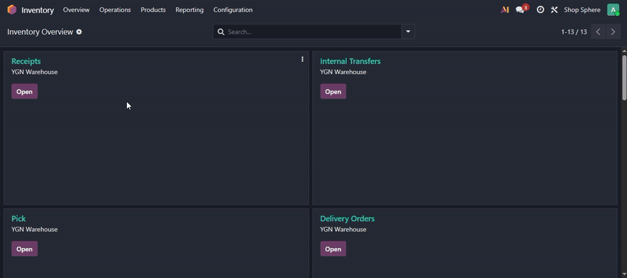

This demo shows the main workflow: creating a consignment order, confirming it, validating a partial stock transfer, creating a backorder, and returning to the consignment order where the transfer status/count remains linked to the consignment workflow.

## Screenshots

### 1. Consignment shop setup

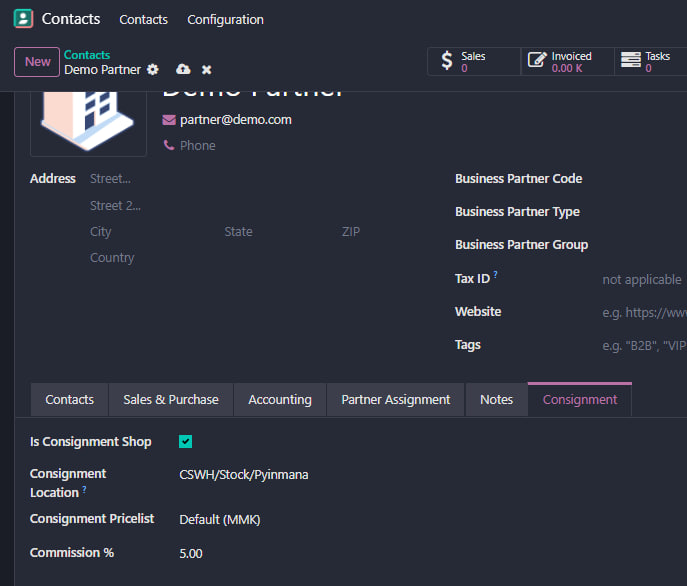

### 2. Consignment warehouse setup

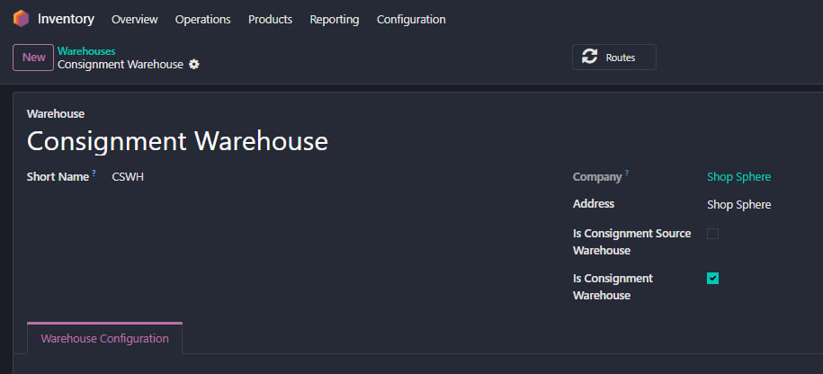

### 3. Consignment order list

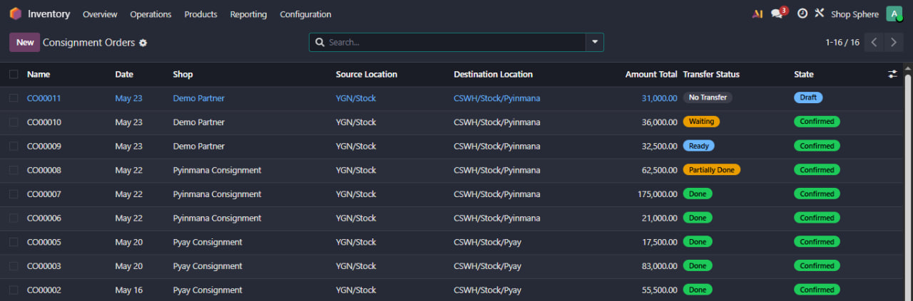

### 4. Consignment order form

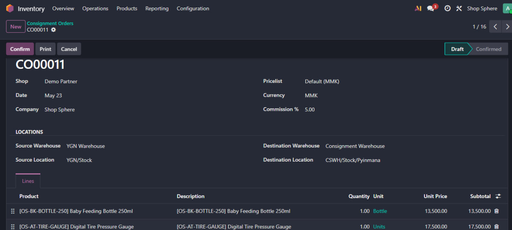

### 5. Transfer smart button and transfer status

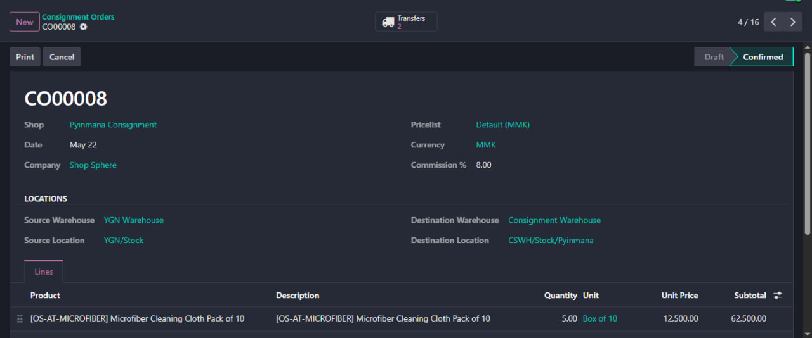

### 6. Partial transfer and backorder

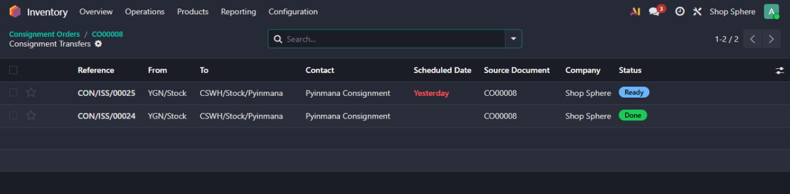

### 7. Consignment transfers list

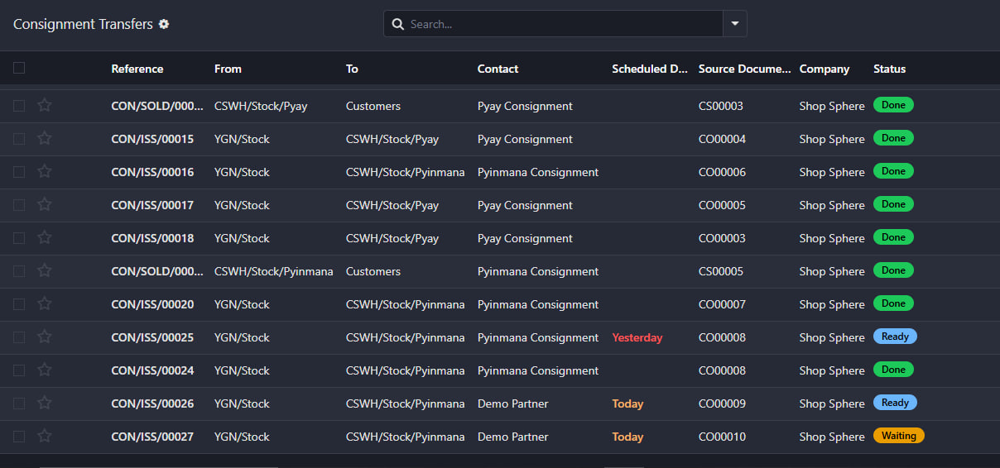

### 8. Consignment settlement list

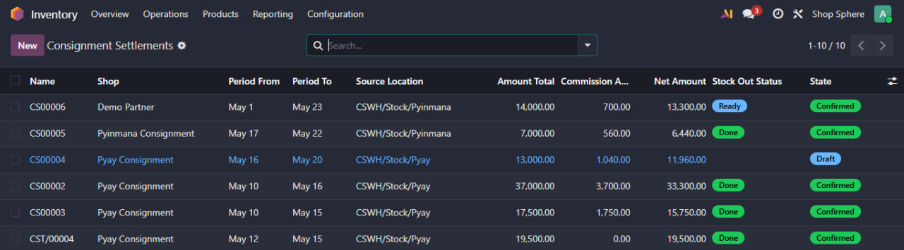

### 9. Invoice and commission bill actions

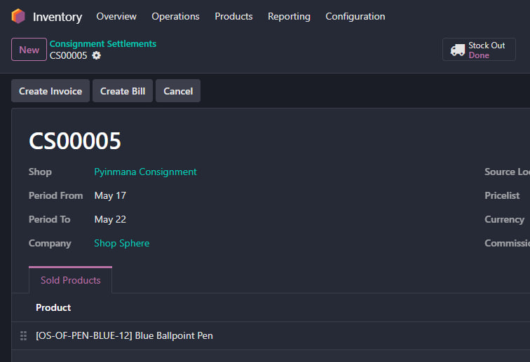

### 10. Created invoice and commission bill

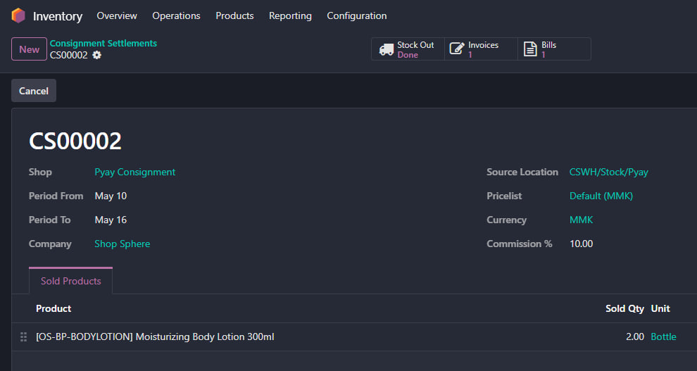

### 11. Consignment return form

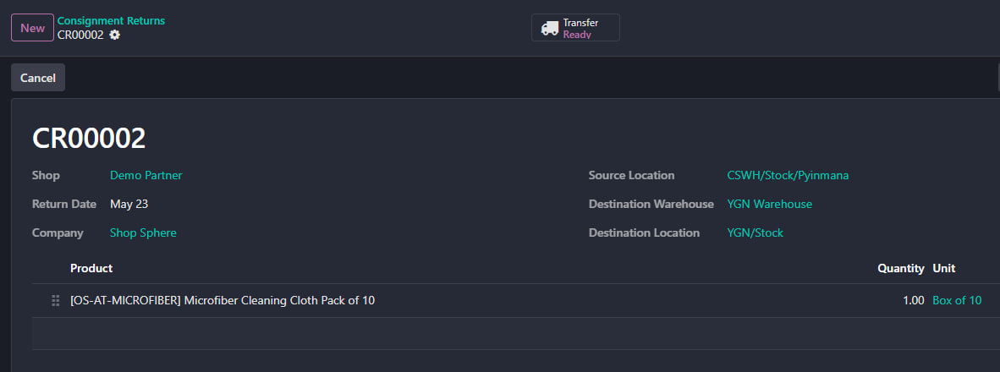

### 12. Consignment order print wizard

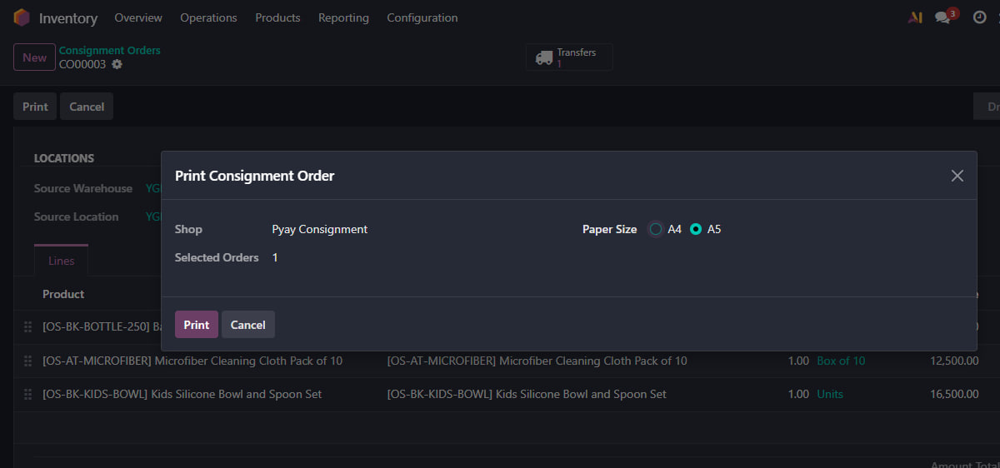

### 13. Consignment order PDF report

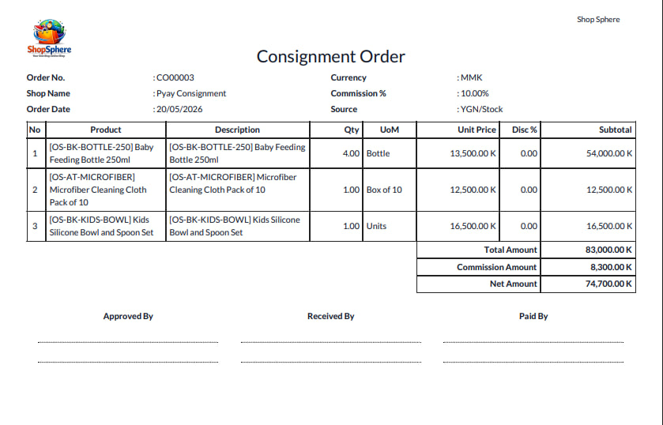

## License

LGPL-3

## Author

Thein Htoo Aung
